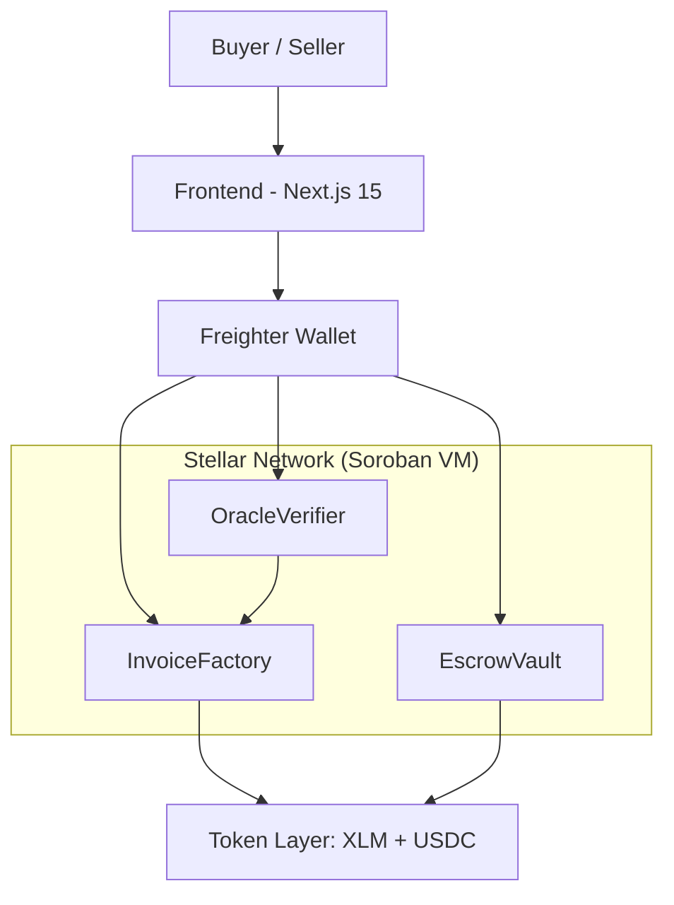
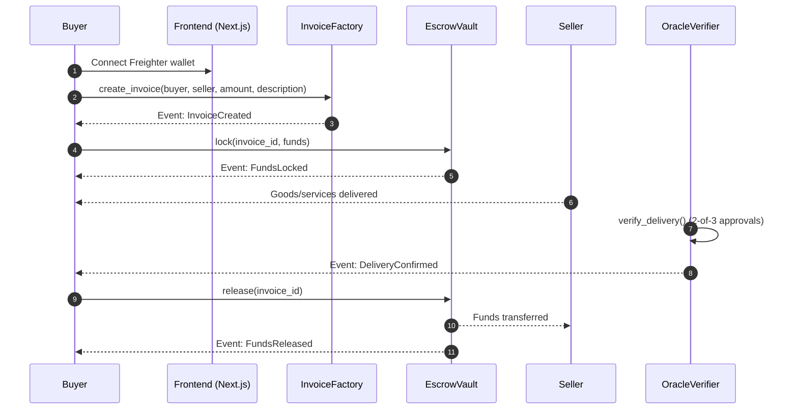

# Nexura Protocol — Architecture Document

## System Overview

Nexura Protocol is a trustless smart invoice ecosystem built on Stellar that solves the SME Inflation-Liquidity Trap by converting net-30/60 payment terms into instant, yield-bearing escrow contracts with automated bulk worker payouts.

---

## Layer Architecture



### Layer 1 - Stellar Blockchain (Soroban VM)

- Network: Stellar Testnet -> Mainnet
- Execution: Soroban WASM runtime
- Finality: ~5 seconds
- Fees: ~0.00001 XLM per operation
- Assets: Native XLM + Circle USDC (SEP-41)

### Layer 2 - Smart Contracts (Rust)

#### InvoiceFactory (`CA3EIXJF43GIEYG3DQC7GNKREF7FK57YKUALLABDH66GRBLSCGYJCDMH`)

- Entry point for invoice creation.
- `create_invoice(buyer, seller, amount, description)` emits `InvoiceCreated`.
- Stores invoice metadata on-chain.
- Authorization: buyer signature required.

#### EscrowVault (`CCPIEXBMQ5ULOOZHDGRODRLEYCVWIGNHODBTJO4JQ25MIOHCONODAZBF`)

- `lock(invoice_id, funds)` transfers tokens into escrow.
- `release(invoice_id)` pays the seller after delivery verification.
- Security features: reentrancy guard via storage lock flag, overflow protection via `checked_add` and `checked_mul`, and single-use release guard (prevents double release).

#### OracleVerifier (`CB7YB2EXLCPLEMEGXR7NJKEED22EID2VIGHL5OFTFH4PXZWLLNOOIJHW`)

- `verify_delivery(invoice_id, verifier, approved)` enforces 2-of-3 multisig.
- Only authorized verifiers can submit confirmations.
- Threshold-based final approval (default: 2 approvals).

### Layer 3 - Frontend (Next.js 15)

#### Separation of Concerns

- `app/`: Next.js App Router pages.
- `hooks/useWallet.ts`: Freighter wallet integration.
- `components/`: reusable UI components.

#### Wallet Integration

- Freighter browser extension via `@stellar/freighter-api`.
- No seed phrase handling in frontend.
- Users sign transactions directly in Freighter.

## Invoice Lifecycle Flow

### Data Flow - Invoice Lifecycle



1. Buyer connects Freighter wallet.
2. Buyer creates invoice via `InvoiceFactory.create_invoice()`.
   Event: `InvoiceCreated`
3. `EscrowVault.lock()` transfers funds from buyer to contract.
   Event: `FundsLocked`
4. Seller delivers goods/services.
5. `OracleVerifier.verify_delivery()` collects 2-of-3 multisig approvals.
   Event: `DeliveryConfirmed`
6. `EscrowVault.release()` pays seller.
   Event: `FundsReleased`
7. Transaction complete.

## Project Structure (GitHub View)

```text
NexuraProtocol/
|-- contracts/
|   |-- invoice_factory/
|   |   `-- src/lib.rs
|   |-- escrow_vault/
|   |   `-- src/lib.rs
|   `-- oracle_verifier/
|       `-- src/lib.rs
|-- frontend/
|   |-- app/
|   |   |-- page.tsx
|   |   |-- layout.tsx
|   |   |-- create-invoice/page.tsx
|   |   `-- dashboard/page.tsx
|   |-- components/
|   |-- hooks/
|   `-- public/
|-- docs/
|   |-- ARCHITECTURE.md
|   |-- DEPLOYMENT.md
|   `-- FEEDBACK.md
|-- README.md
`-- .gitignore

